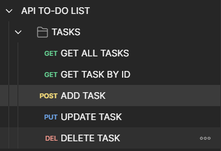
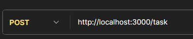
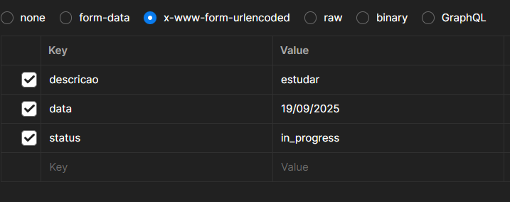
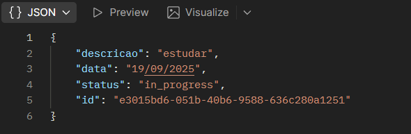

# 📝 API TO-DO LIST


API simples para gerenciamento de tarefas com **Node.js**, **TypeScript** e **Express**, organizada em **controllers**, **services**, **repositories**, **models** e **schemas**.

---

## 🚀 Funcionalidades

- `GET /tasks` – Listar tarefas  
- `GET /tasks/:id` – Buscar por ID  
- `POST /tasks` – Criar tarefa  
- `PUT /tasks/:id` – Atualizar tarefa  
- `DELETE /tasks/:id` – Remover tarefa  

> **Validação de dados** garantida com TypeScript e schemas.

---

## ⚙️ Instalação & Execução

```bash
yarn init -y
yarn add express @types/express -D typescript ts-node nodemon -D
nodemon index.ts
````

## 🧪 Testando com Postman

1. Abra o **Postman** e organize as rotas em pastas por funcionalidade.

   

3. Adicione requisições correspondentes a cada pasta.
   
   

5. Preencha os campos solicitados em cada requisição.
   
   

7. Envie a requisição e visualize a resposta do servidor.
   
   


---

## 📂 Estrutura do Projeto


src/

├─ controllers/     # **Gerencia requisições HTTP**

├─ services/        # **Regras de negócio**

├─ repositories/    # **Manipulação de dados**

├─ models/        # **Estrutura dos dados**

├─ schemas/       # **Validação dos dados**

index.ts          # **Arquivo principal**

---

## 🤝 Contribuição

Contribuições são bem-vindas! Siga estes passos:

1. Faça um fork do projeto
2. Crie uma branch para sua feature (`git checkout -b feature/nova-feature`)
3. Commit suas alterações (`git commit -m 'Adiciona nova feature'`)
4. Faça push para a branch (`git push origin feature/nova-feature`)
5. Abra um Pull Request

---

## ✨ Status do Projeto

* **Desenvolvimento:** ✅ Em andamento
* **Testes:** 🔄 Parcialmente implementados
* **Deploy:** 🚀 Futuro

---


